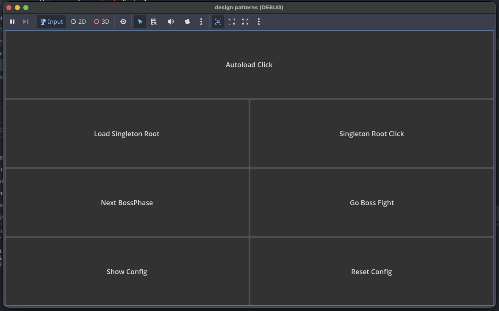
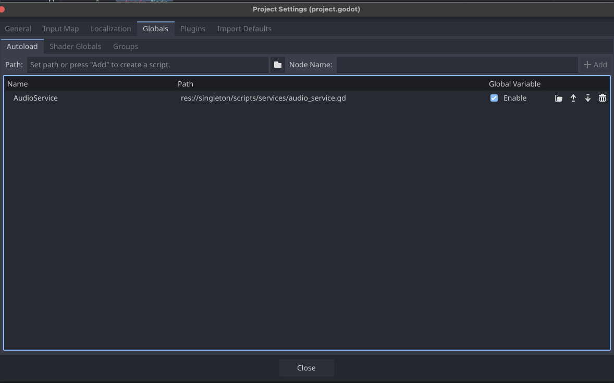
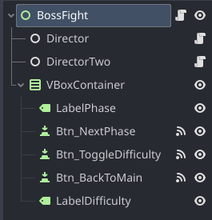

Cuando se está aprendiendo Godot, se suele escuchar que **"Singleton = Autoload"**. 🤔
Y pues técnicamente Autoload es _la forma más cómoda_ de tener un elemento Global, pero **Singleton como patrón** es otra cosa.

💡 **La diferencia clave:**
- **Singleton** es la _idea_: "quiero **una sola instancia** de algo".
- **Autoload** es la _herramienta de Godot_: "instánciame esto al inicio y déjalo vivo todo el tiempo".

🎯 **La parte clave es esta:**

> ⚠️ **No todo singleton debería ser global.**  
> ✨ A veces lo quieres solo dentro de una escena (y que muera cuando sales).  
> 🔧 A veces lo quieres persistente pero creado manualmente.  
> 📝 Y a veces lo quieres estático solo para configuración en memoria

En este post armamos una demo y explicamos **4 formas reales**:

1. **Autoload (Godot)**
2. **Singleton por escena** (vive solo en el nivel y se destruye al salir)
3. **“Autoload manual”** (lo creas en Main y lo montas en el root)
4. **Singleton estático** (config en memoria + reset a defaults)

---
#
💻 **Código fuente disponible:** Todo el código de este tutorial está disponible en [GitHub](https://github.com/juancadev-io/design-patterns/tree/main/singleton) para que puedas probarlo, modificarlo y aprender experimentando. ¡Es completamente gratis! 🎉
#

---
## 🎮 Demo usada (idea)

Creamos una UI mínima con botones con el fin de poder probar cada patrón de singleton.



> 💡 **Nota:** No te preocupes, más adelante entenderás cómo funciona cada uno.

---

# 1️⃣ Autoload: el "singleton global" de Godot 🌍

Autoload significa que Godot instancia el script o la escena desde el inicio de su ejecución y lo deja colgado en el **root** del árbol de nodos.

✨ **Características:**

- ⏰ Vive **siempre** mientras la app esté abierta. Suele ser de lo primero que se ejecute.
- 🎯 Es ideal para servicios globales como `AudioManager`, `GameManager`, `Settings`, etc.

### Ejemplo: `AudioService.gd`

```gdscript
extends Node

func _enter_tree() -> void:
	print("[AudioService] enter_tree (autoload)")

func _ready() -> void:
	print("[AudioService] ready (autoload)")

func play_ui_click() -> void:
	print("[AudioService] UI Click!")
```

y para activarlo, lo agregamos en el menú de **Project > Project Settings > Globals > Autoload**:



y ya desde cualquier escena lo podrás llamar y el editor de Godot te ayudará con el autocompletado:

```gdscript
AudioService.play_ui_click()
```

> ⚠️ **Advertencia:** Si llegas a instanciar otro `AudioService` por error, no pasará nada raro, solo tendrás dos nodos distintos.

---

# 2️⃣ Singleton por Escena: vive solo en la escena actual 🎬

💥 **Este es el punto que mucha gente no considera:** hay singletons que **no deberían ser globales**.

🎯 **Ideas para implementarlo así:**

- **BossFightDirector**: controla todo lo relacionado a la pelea contra un jefe. No tiene sentido que viva fuera de esa escena pero si que tenga una sola instancia.
- **RunSessions (Roguelike)**: estado de una partida en curso, manejando la vida, items, enemigos, etc.
- **PuzzleController**: si se tiene un puzzle complejo, que solo se activa en cierto nivel.
- **DialogueSession**: controla el estado de los dialogos de los NPCs en una escena, decide cual se activa, etc.

🧠 **La regla mental:**

> 💡 Si el nodo padre / la escena se destruye, ese singleton debería desaparecer.

### Ejemplo: `BossFightDirector.gd`

```gdscript
extends Node
class_name BossFightDirector

static var instance: BossFightDirector
var phase := 1

func _enter_tree() -> void:
	if instance != null and instance != self:
		queue_free()
		print("[BossFightDirector] not created")
		return
	instance = self
	print("[BossFightDirector] created")

func _exit_tree() -> void:
	if instance == self:
		instance = null
		print("[BossFightDirector] destroyed")

func next_phase() -> int:
	phase += 1
	print("[BossFightDirector] phase -> ", phase)
	return phase
```

> 📌 **Importante:** `class_name` único para que se pueda usar en cualquier script y usar `instance` como acceso global.

Y en la escena del boss, lo agregamos como nodo hijo:



En la imagen vemos dos **Directores**, esto con el fin de que cuando se inicie la escena, el segundo se destruya y solo quede uno.

Y así lo llamaríamos desde cualquier script:

```gdscript
func _on_btn_next_phase_pressed() -> void:
	var newPhase = BossFightDirector.instance.next_phase()
	labelPhase.text = str(newPhase)
```

o

```gdscript
if BossFightDirector.instance:
  BossFightDirector.instance.next_phase()
else:
  print("[Main] No BossFightDirector (not in boss scene)")
```

> 💡 **Tip:** Técnicamente ambos scripts funcionan igual, pero el segundo evita errores si se llama fuera de la escena del boss.

### 🔍 ¿Qué demostramos en la demo?

- En **Main**, intentas usar el director y no existe.
- En **BossFight**, al entrar:
  - se crea la instancia
  - si hay duplicados, se elimina el extra
- Al salir de la escena:
  - `_exit_tree()` se ejecuta
  - `instance = null`

✅ Esto te permite tener un singleton **controlado por contexto**, sin contaminar el resto del juego.

---

# 3️⃣ "Autoload manual": persistente, pero lo creas tú desde código y lo montas en root 🔧

A veces quieres un servicio que **persista** entre escenas, pero no es bueno registrarlo como Autoload. 

🎯 **El ejemplo clásico:** sistema de envío de analíticas
- ❌ Si el usuario no acepta términos → no debería existir
- ✅ Si acepta → debería vivir todo el tiempo

📋 **Más ejemplos:**
- `SaveService` que solo montas cuando entras al juego (no en el menú inicial).
- `TelemetryService` o `NetworkService` que solo existe cuando el usuario está conectado.

💡 **La idea es simple:**
1. 🏗️ Instancias el servicio desde la escena que se quiera (`Main`/`Boot`)
2. 🔗 Lo cuelgas del `get_tree().root`
3. ✅ Listo: sobrevive `change_scene`

### Ejemplo: `SaveService.gd`

```gdscript
extends Node
class_name SaveService

static var instance: SaveService

func _enter_tree() -> void:
	if instance != null and instance != self:
		queue_free()
		print("[SaveService] not created")
		return
	instance = self
	print("[SaveService] created")

func _exit_tree() -> void:
	if instance == self:
		instance = null
		print("[SaveService] destroyed")

func save_game() -> void:
	print("[SaveService] Saving...")

```
y en la escena Main lo creamos y montamos:

```gdscript
	var save_service = SaveService.new()
	save_service.name = "SaveService"
	get_tree().root.add_child(save_service)
```

y ya desde cualquier escena lo podrás llamar igual que antes:

```gdscript
func _on_btn_save_root_service_pressed() -> void:
	if SaveService.instance:
		SaveService.instance.save_game()
	else:
		print("[Main] No SaveService (load Singleton)")
```
> ⚠️ **Importante:** Por más que intentes crear otro `SaveService`, el patrón singleton evitará que se creen múltiples instancias.
> 💡 **Recomendación:** Siempre valida que exista la instancia antes de usarla.

### ✨ Beneficio principal
- Se comporta como un Autoload (vive todo el tiempo y si cambias de escena no se destruye)
- Pero tienes control total de **cuando** se crea (no al inicio del juego necesariamente)

---

# 4️⃣ Singleton estático: configuración en memoria + reset a defaults 📝

Hay casos donde no necesitas nodos, ni un lifecycle determinado, ni siquiera existir en el árbol de nodos.
Solo necesitas guardar configuración en **memoria** y que sea accesible desde cualquier parte.

💡 **Esto que te acabo de describir es un singleton estático.**

🎯 **El mejor ejemplo:** modificadores globales o settings.

### Ejemplo: `GameConfig.gd`

```gdscript
class_name GameConfig

static var DEFAULTS := {
	"master_volume": 0.8,
	"fullscreen": false,
	"difficulty": "normal"
}

static var current := DEFAULTS.duplicate(true)

static func set_value(key: String, value) -> void:
	current[key] = value

static func get_value(key: String, fallback = null):
	return current.get(key, fallback)

static func reset_to_defaults() -> void:
	current = DEFAULTS.duplicate(true)

static func show_current_info():
	for key in current:
		print(key, " = ", current[key])

static func toggle_difficulty():
	if current["difficulty"] == "normal":
		current["difficulty"] = "hard"
	else:
		current["difficulty"] = "normal"

```
y desde cualquier script lo podrás usar así:

```gdscript
func _on_btn_reset_config_pressed() -> void:
	GameConfig.reset_to_defaults()
	print("[Main] config reset")

func _on_btn_show_current_config() -> void:
	GameConfig.show_current_info()
```
> 🔍 **Observa:** No extendemos `Node` ni usamos lifecycle, solo definimos variables y funciones estáticas. 
> ✨ Pero igual usamos `class_name` para facilitar su uso.

### 🎯 Lo importante
- Esto vive **en memoria**.
- Si cierras el juego, vuelve a defaults.
- Si quieres que al terminar una partida vuelva a la base, llamas:

```gdscript
GameConfig.reset_to_defaults()
```

> 💾 **Nota:** Si quieres persistirlo entre sesiones, ahí sí ya hablamos de guardarlo en disco, pero de eso hablamos otro día.

---

# 🤔 ¿Cuál usar y cuándo?

Todo depende del contexto y necesidades de tu juego, pero aquí un resumen rápido:

## Autoload

✅ Cuando el servicio debe existir siempre (audio global, input global, analytics).  
❌ No usarlo como “bolsa global de variables” para todo.

## Singleton por escena

✅ Cuando el estado solo tiene sentido en un nivel/escena (boss, puzzle, run).  
✅ Cuando quieres que se destruya automáticamente al salir.  
❌ No lo uses si necesitas que persista entre escenas.

## Root manual (autoload controlado)

✅ Cuando quieres persistencia entre escenas **pero con control de creación**.  
✅ Útil para sistemas por “modo”: gameplay, login, etc.  
❌ Si siempre debe existir, mejor Autoload.

## Static config

✅ Config y estado simple en memoria, sin nodos.  
✅ Reset fácil a defaults al cerrar partida o reiniciar run.  
❌ No sirve si necesitas señales, timers, procesamiento, o acceso al árbol.

# 🎯 Conclusión

Godot te da autoload, y está bien... pero el patrón singleton es **mucho más que eso**.

✨ Con estas 4 formas puedes adaptar el patrón a tus necesidades reales, evitando malas prácticas como:
- ❌ Usar un autoload como "bolsa global de variables"
- ❌ Tener en memoria cosas que no deberían existir todo el tiempo

🎯 **Lo importante:** Entender el **concepto** de singleton (una sola instancia) y adaptarlo a las herramientas que Godot te da, para crear sistemas limpios y mantenibles.

💡 **Recuerda:** El patrón singleton es solo una pieza del rompecabezas, úsalo sabiamente junto con otras prácticas de diseño para crear sistemas complejos y optimizados.

---

¡Y como siempre, feliz coding! 🚀✨